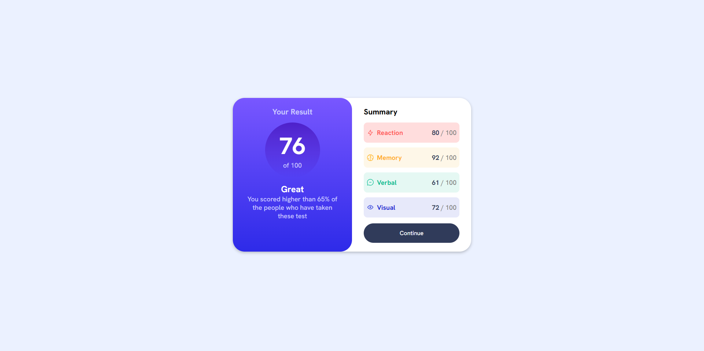

# Frontend Mentor - Results Summary component solution

This is a solution to the [Results Summary component challenge on Frontend Mentor](https://www.frontendmentor.io/challenges/results-summary-component-CE_K6s0maV). Frontend Mentor challenges help you improve your coding skills by building realistic projects.

## Table of contents

- [Overview](#overview)
  - [Screenshot](#screenshot)
  - [Links](#links)
- [My process](#my-process)
  - [Built with](#built-with)
  - [What I learned](#what-i-learned)
  - [Continued development](#continued-development)
- [Author](#author)

## Overview

### Screenshot

### Links

- Solution URL: [Github Repository](https://github.com/Alaaa1/Results-Summary-Component-Frontend-Mentor)
- Live Site URL: [Github Pages](https://alaaa1.github.io/Results-Summary-Component-Frontend-Mentor/)

## My process

### Built with

- Semantic HTML5 markup
- CSS custom properties
- Flexbox

## Author

- Website - [Alaa](https://alaaa1.github.io/)
- Frontend Mentor - [@Alaaa1](https://www.frontendmentor.io/profile/Alaaa1)
